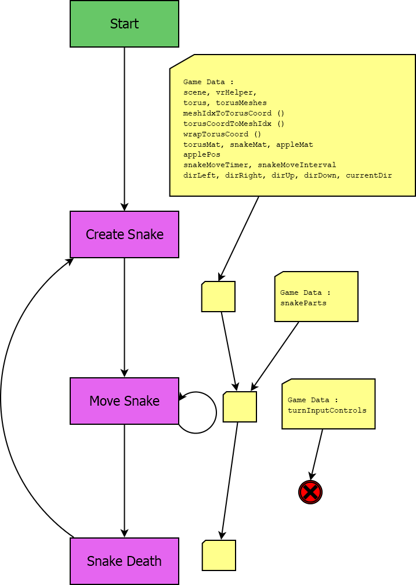

Game Logic
==========

The modules that control the behaviour of the game can be found in this
directory.  

The system creates a torus mesh using Babylon's Mesh Builder.  At the 
position of each mesh of the torus a smaller mesh is created.  These 
smaller meshes act like the pixels of a 2D display on the surface of the
torus and are enabled or disabled in order to display the snake.

The snake moves on a 2D grid and the positions of its body parts are 
translated to positions in the 'torusMeshes' list - the list of smaller 
meshes.  

The X axis of snake movement describes movement around the smaller circles
of the torus - the circumference of the tube.

The Y axis of snake movement describes movement on the larger circles - 
the disc of the torus that surrounds the player.

The flow of gamestates is shown in the following diagram.

Some details on the finite state machine used in the project can be
found below.

Config
======

A data structure that defines immutable properties explicitly.  The data
is globally accessible and contains definitions that many system components
may need.

The data is defined in:

    config.js

The configuration variables defined by this game are:

    * snakeMoveInitialInterval
     - The initial delay between automatic moves of the snake.

    * dirUp, dirDown, dirLeft, dirRight
     - The 2D direction vectors used to control what direction the snake
       is moving on the torus surface.

    * isValidDirection ( d )
     - A function that returns true or false if d is a valid direction.

    * upPos, downPos, rightPos, leftPos
     - The positions that the directional control plane buttons are placed.

    * turnControlPlaneSize
     - Value used to scale the size of the directional control plane buttons.

Game Data
=========

A data structure holding properties that are instantiated during run-time
and are expected to persist throughout the entire lifetime of the game.

These may be properties such as the rendering engine, scenes, meshes,
textures and sounds.  

The data is expected to mostly be created by babylon library calls during
the 'startState'.  i.e. The initial state of the system.

gameData has the following properties:

    * engine - The BabylonJS engine that is rendering to the canvas.

    * torus - The mesh of the ring that surrounds the player
    
    * torusMeshes - A list of meshes, one for each vertex of the torus.
                    This list is used to draw the graphics of the snake.
    
    * snakeMat - The material used for meshes that are part of the snake's
                 body.
 
    * appleMat - The material used for the apple.

    * snakeMoveInterval - The time in seconds between each snake move.

    * snakeMoveTimer - The time in seconds until the next snake move.

gameData defines two functions that are used to map between the 2D
coordinate system of the snake and the torusMeshes list:

    * gameData.meshIdxToTorusCoord :

      Maps a list index to a 2 dimesnioal { x, y } coordinate

    * gameData.torusCoordToMeshIdx :
 
      Maps a 2D { x, y } coordinate tuple to an index of the 
      torus meshes list.  If the x or y values exceed the width and
      height of the space then the coordinates will be wrapped.

Modules
=======

The main modules are:

    * StartState.js: 

      The initial state of the game loop.  Performs initialization of data.

    * CreateSnakeState.js:
      
      This game loop state creates the snake data as it should
      be of the beginning of a new game.

    * SnakeMoveState.js:

      This game loop state handles the delay timer between moves.

    * updateTorusMeshes.js:

      This function changes the torus Meshes to display the current
      state of the snake.

These modules use the namespace 'window.babylonProject'.

Modules that are not specific to any game are found in:
    ./base_game/

These modules use the namespace 'window.babylonProject'.

The single point of access from the HTML file that contains the canvas
can be found in:
    
     ./base_game/jQueryDomFunctions.js

It defines the document ready function which simply passes the external
dependencies of the project to the page loaded function found in:

    ./base_game/pageLoaded.js

The page loaded function performs some initialization and starts the game
loop with the initial state defined in:

    ./startState.js

The pageLoaded function will set startState as the first state function
to be called by the game loop.

The following parameters will be passed to the startState function:

    - babylon: The instance of the babylon library object.  Commonly
               referred to by the global BABYLON - it is explicitly
               passed as a dependency parameter in this project.

    - gameData: A data structure for holding the current game state.
                The page loaded function will only set one value:

    - gameData.engine:  The BabylonJS engine instance that is currently
                        rendering to the canvas.

Game Loop Finite State Machine
==============================

The project uses a finite state machine to encode the various states the
game could be in.  Some example states would be the Main Menu, Gameplay
and Game Over screen.

A Game State is an object with an update() function.  The update function
is called once per tick of the game loop and should be used to advance the
by a single time step and return the new game state.

In a normal update call of a game state the object would check for 
collisions, update the positions of all game objects and then return itself.

If the player were to die the state would construct the Game Over state and
return that.

The initial state that the game enters into when the page is loaded can
be found in:
   
    ./startScene.js

The game loop is found in:
    
    ./base_game/gameLoop.js

The game loop is called repeatedly using Babylon's runRenderLoop function.
